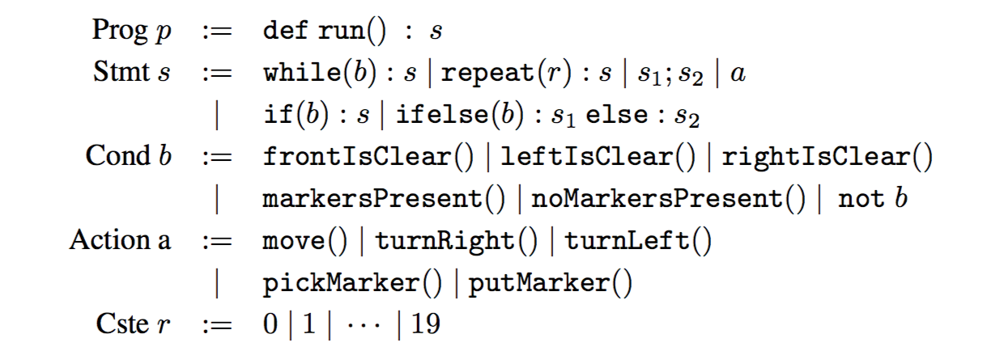

# Karel Dataset

This is the code used to generate the [Karel](https://en.wikipedia.org/wiki/Karel_(programming_language)) dataset as described in following papers:

- [Leveraging Grammar and Reinforcement Learning for Neural Program Synthesis](https://openreview.net/forum?id=H1Xw62kRZ) ([code](https://github.com/carpedm20/program-synthesis-rl-tensorflow))
- [Neural Program Meta-Induction](https://arxiv.org/abs/1710.04157)


## Introduction

[Karel](https://en.wikipedia.org/wiki/Karel_(programming_language)) is an educational programming languag. The Domain-specific language for Karel programs is:



but I added `{`, `}` and removed `:` to explicitly represent the scope without tabspace.

The state of the grid world are represented as a `H x W x 16` tensor. Each cell of grid is the 16-dimensional vector indicated as:

| Index |    Description    |
|:-----:|:-----------------:|
|   0   | Hero facing North |
|   1   | Hero facing South |
|   2   |  Hero facing West |
|   3   |  Hero facing East |
|   4   |    Wall or not    |
|   5   |      0 marker     |
|   6   |      1 marker     |
|   7   |      2 marker     |
|   8   |      3 marker     |
|   9   |      4 marker     |
|   10  |      5 marker     |
|   11  |      6 marker     |
|   12  |      7 marker     |
|   13  |      8 marker     |
|   14  |      9 marker     |
|   15  |     10 marker     |


## Usage

### 0. Installation

To install `karel` package:

    $ pip install karel

### 1. Data generation

There are two types of parser which can be defined with `--parser_type`:

1. `curly`: Karel + curly braces (`{`, `}`)
2. `synthesis`: Karel for program synthesis (examples can be found [here](https://msr-redmond.github.io/karel-dataset/))

To generate programs and its input/output examples:

    $ python generate.py --data_dir=data --max_depth=5 --parser_type=synthesis

which will generate `data/train.npz`, `data/test.npz` and `data/val.npz` and you can use these data with:

```python
data = np.load(npz_path)
for input, output, code in zip(data['inputs'], data[outputs'], data['codes']):
    train(input, output, code)
```

To generate programs only as text:

    $ python generate.py --mode=text --beautify=True --parser_type=curly

and it will generate `data/train.txt`, `data/test.txt` and `data/val.txt` that contain codes like:

    def run() {
      while(right_is_clear()) {
        repeat(7) {
          put_marker()
        }
      }
    }
    def run() {
      while(left_is_clear()) {
        repeat(13) {
          pick_marker()
        }
      }

      while(no_markers_present()) {
        ifelse(right_is_clear()) {
          put_marker()
        }
        else {
          pick_marker()
        }
      }
    }

### 2. Interpreter

To run Karel interpreter (with random grid world):

    $ python -m karel.parser_with_curly
    In [1]: def run() {
       ...:   repeat(7) {
       ...:     ifelse(front_is_clear()) {
       ...:       move()
       ...:     }
       ...:     else {
       ...:       turn_right()
       ...:     }
       ...:   }
       ...: }
    Input:  ########
            #.1.1#.#
            ##..1..#
            #.11.1##
            #1>1..1#
            ##....1#
            #.#....#
            ########
    Output: ########
            #.1.1#.#
            ##..1..#
            #.11.1##
            #1.1..1#
            ##....1#
            #.#...v#
            ########
    In [2]:

or,

    $ python -m karel.parser_for_synthesis
    In [1]: DEF run m( IF c( frontIsClear c) i( turnRight move i) m)
    Input:  ########
            #....#.#
            #......#
            #.oo..##
            #o>....#
            #.....o#
            #......#
            ########
    Output: ########
            #....#.#
            #......#
            #.oo..##
            #o.....#
            #.v...o#
            #......#
            ########
    In [2]:

To run Karel interpreter with a world file (ex. `assets/simple.world`):

    $ python -m karel.parser_with_curly --world=assets/simple.world
    In [1]: def run() {
       ...:   repeat(7) {
       ...:     ifelse(front_is_clear()) {
       ...:       put_marker();
       ...:       move()
       ...:     }
       ...:     else {
       ...:       turn_right()
       ...:     }
       ...:   }
       ...: }
    Input:  ########
            #....#.#
            ##..o..#
            #.....##
            #.>....#
            ##.....#
            #.#....#
            ########
    Output: ########
            #....#.#
            ##..o..#
            #.....##
            #.ooooo#
            ##....o#
            #.#...v#
            ########
    In [2]:


## Author

Taehoon Kim / [@carpedm20](http://carpedm20.github.io/)
